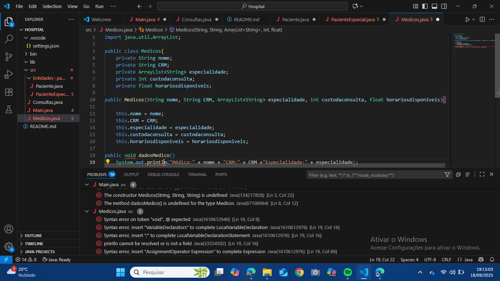
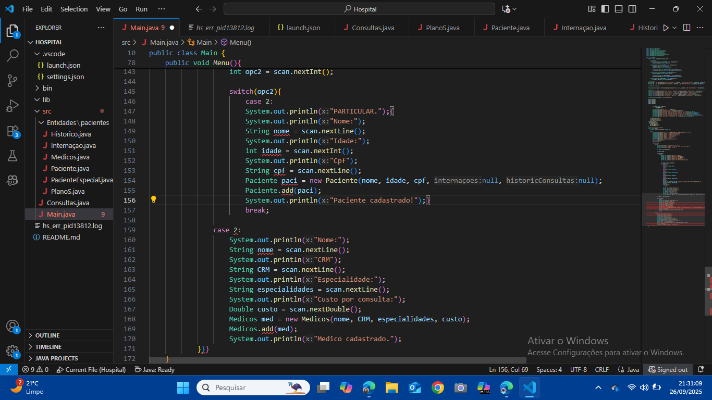

# Dados do Aluno
Nome completo: Ítalo Carlos Santana Dias do Nascimento

Matrícula: 242015639

Curso: Orientação e Objetos

Turma: [Preencher aqui]

# Sistema Hospitalar

Projeto desenvolvido para a disciplina de Programação Orientada a Objetos com o professor Lucas boaventura.

## Descrição

Este sistema foi desenvolvido para gerenciar informações de pacientes em um hospital, permitindo o cadastro, atualização e consulta de dados. Utiliza Java como linguagem principal e armazena dados em arquivos de texto.

## Tecnologias utilizadas
- Java 17+
- Arquivos de texto para persistência de dados
- IDE: VS Code

## Funcionalidades
- Cadastro de pacientes
- Cadastro de medicos
- Atualização de informações
- Consulta de dados
- Persistencia de dados
- Registrar e liberar Internações

## Instruções para Compilação e Execução
Compilação:
[Descrever aqui como compilar o projeto. Exemplo: javac Main.java ou o script usado]

Execução:
[Descrever aqui como executar o projeto. Exemplo: java Main ou o script usado]

Estrutura de Pastas:
Consultas, Entidades/pacientes, e Internaçoes.

Versão do JAVA utilizada:
[Descrever aqui como versão do JAVA utilizada no projeto. Sugestão: java 21]

## Vídeo de Demonstração
[video:](https://youtu.be/DKAlNRuJlgw)

## Prints da Execução
Elaborando Main:

Cadastro de Médico:

Relatório de ?:

## Contato
Email: itacarlosnas@hotmail.com

## Observações (Extras ou Dificuldades)
Foi um grande desafio (até demais) pra um primeiro trabalho não só de orientação emm objetos, mas tambem primeiro em java.

Na criação das classes foi tranquilo, mas na main foi erro atras de erro o tempo todo(faz parte).

Eu não tinha me informado direito em relação aos commits, foi saber só 5 dias antes da entrega do projeto, ainda assim dividi os commits em partes ate o dia do trabalho, mas ja estava produzindo a quase 1 mês como mostra no print de execução.

## Como executar
1. Pela classe main, se atentando aos formatos aceitos pelo codigo
